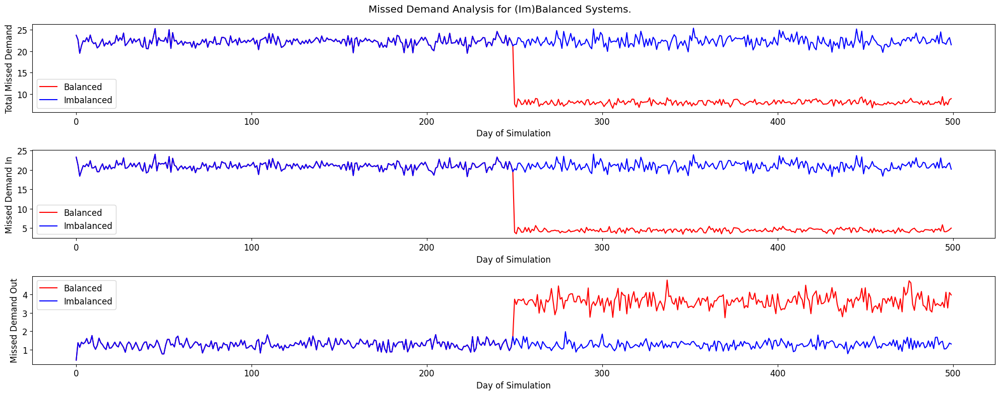

[Bike_Sharing_DES_Optimization_GitHub_Summary_v8.md](https://github.com/user-attachments/files/28522943/Bike_Sharing_DES_Optimization_GitHub_Summary_v8.md)
# Bike Sharing System Rebalancing Using Discrete-Event Simulation and Optimization

## Project Summary

This project studies the overnight rebalancing problem in a bike sharing system. Bike sharing systems provide a flexible and environmentally sustainable mode of urban transportation, but their performance depends heavily on whether bikes and empty docks are available when riders need them. If too few bikes are available at a station, customers who want to start a trip are lost. If too few empty docks are available, customers who want to end a trip must search for another station. These two failure modes create an imbalance problem that can reduce rider satisfaction and system reliability.

The goal of this project is to evaluate whether an optimization-based overnight rebalancing policy can improve system performance under uncertainty. The model combines a mathematical optimization formulation for deciding midnight bike allocations with a discrete-event simulation (DES) that represents day-to-day system operations. The simulation tracks rider arrivals, trip completions, station inventory levels, missed demand, station capacity, and bike reliability. The optimization model is then used as a control policy inside the simulation to compare a rebalanced system against an imbalanced baseline.

## Problem Setting

The system consists of five bike sharing stations with fixed dock capacities and an initial number of bikes at each station. Riders arrive at stations over time to rent bikes, travel to destination stations, and return bikes if an empty dock is available. The numerical setting uses time-dependent arrival rates to reproduce realistic demand patterns, including morning and evening rush-hour behavior. Ride times are exponentially distributed with station-pair-specific means, and origins and destinations are sampled across the five stations.

A central challenge is that the observed station inventory process does not fully reveal true demand. When a station is empty, a rider who wants to rent a bike is missed, and the station level remains zero. Similarly, when a station is full, a rider who wants to return a bike cannot dock there. Simply using observed inventory levels may therefore underestimate true demand. To address this, the optimization model is based on masked demand histories, leaving out periods where a station is empty or full and hence observed demand is censored.

## Optimization Model

The project uses a discrete-event simulation model to evaluate an overnight bike-rebalancing policy. The policy itself is generated by solving an optimization model at midnight. The goal is to decide how many bikes should be allocated to each station before the next operating day begins, so that no station becomes too empty or too full during the day.

### Notation

Let \(\mathcal{S}\) be the set of stations and let \(\mathcal{T}\) be the set of time periods in one operating day. For each station \(s \in \mathcal{S}\) and each time period \(t \in \mathcal{T}\), define

$$
\begin{aligned}
X_s &= \text{number of bikes allocated to station } s \text{ overnight},\\
D &= \text{maximum imbalance across all stations},\\
B &= \text{total number of available bikes in the system},\\
f_t^s &= \text{predicted net flow at station } s \text{ by time } t,\\
c(s) &= \text{capacity of station } s.
\end{aligned}
$$

Here, \(X_s\) is the main decision variable. It determines how many bikes should be placed at station \(s\) at midnight before the next operating day begins. The variable \(D\) is an auxiliary decision variable that represents the largest imbalance across the system. The optimization problem minimizes \(D\), so the model tries to make the worst station as balanced as possible.

The parameter \(B\) is the total number of usable bikes available for allocation. The parameter \(c(s)\) is the dock capacity of station \(s\), meaning that station \(s\) cannot hold more than \(c(s)\) bikes.

The term \(f_t^s\) represents the predicted cumulative net flow at station \(s\) by time \(t\), defined as

$$
f_t^s
=
\text{cumulative demand-in at station } s \text{ by time } t
-
\text{cumulative demand-out at station } s \text{ by time } t.
$$

A positive value of \(f_t^s\) means that more bikes are expected to be returned to station \(s\) than borrowed from it by time \(t\). A negative value means that more bikes are expected to be borrowed from station \(s\) than returned to it by time \(t\).

### Base Formulation

The overnight allocation problem is formulated as follows:

$$
\begin{aligned}
\min_{D,\,X_s} \quad & D \\
\text{subject to} \quad
& \sum_{s \in \mathcal{S}} X_s \leq B, \\
& D \geq X_s + \min_{t \in \mathcal{T}} f_t^s, \quad \forall s \in \mathcal{S}, \\
& D \geq c(s) - X_s - \max_{t \in \mathcal{T}} f_t^s, \quad \forall s \in \mathcal{S}, \\
& X_s \in \{0,1,\ldots,c(s)\}, \quad \forall s \in \mathcal{S}, \\
& D \geq 0.
\end{aligned}
$$

### Explanation of the Formulation

The objective minimizes \(D\), the maximum imbalance over all stations. This creates a min-max allocation rule: instead of optimizing one station at the expense of others, the model tries to keep the worst station as balanced as possible.

The first constraint is

$$
\sum_{s \in \mathcal{S}} X_s \leq B.
$$

This ensures that the total number of bikes assigned to stations does not exceed the number of usable bikes available in the system. The inequality allows the model to allocate fewer bikes than the total available number if this helps avoid overfilling stations.

The second set of constraints is

$$
D \geq X_s + \min_{t \in \mathcal{T}} f_t^s,
\qquad \forall s \in \mathcal{S}.
$$

These constraints control the risk of a station becoming empty. Starting with \(X_s\) bikes, the most negative value of the predicted net flow represents the largest cumulative depletion of bikes during the day. If this quantity is too small, the station is likely to run out of bikes. By bounding this expression through \(D\), the model limits shortage-related imbalance.

The third set of constraints is

$$
D \geq c(s) - X_s - \max_{t \in \mathcal{T}} f_t^s,
\qquad \forall s \in \mathcal{S}.
$$

These constraints control the risk of a station becoming full. The term \(c(s)-X_s\) is the number of empty docks immediately after overnight allocation. The term \(\max_{t \in \mathcal{T}} f_t^s\) captures the largest cumulative net inflow into station \(s\) during the day. Together, these terms represent the station's ability to absorb returning bikes. This constraint therefore limits dock-shortage imbalance, i.e., cases in which riders cannot return bikes because the station has no empty docks.

Finally,

$$
X_s \in \{0,1,\ldots,c(s)\}
$$

ensures that allocations are integer-valued and cannot exceed station capacity.

### Incorporating Uncertainty in Bike Availability

The report also considers uncertainty in the number of usable bikes due to maintenance-related issues. If some bikes are broken, then the true number of available bikes at midnight is random. To account for this, the deterministic bike-availability constraint can be replaced by the chance-constrained version

$$
\sum_{s \in \mathcal{S}} X_s \leq F^{-1}(\epsilon) + 1.
$$

Here, \(F^{-1}(\epsilon)\) is a quantile of the distribution of available bikes. This makes the allocation feasible with probability approximately \(1-\epsilon\). In the numerical experiment, individual bike reliability is modeled using a Bernoulli random variable, so the total number of usable bikes follows a binomial distribution.

### Demand Estimation and Masking

A key input to the optimization problem is \(f_t^s\), the predicted net flow at each station. The project estimates this quantity from simulated historical demand. However, raw station-level observations can be misleading because of censoring. If a rider arrives to borrow a bike when a station is empty, the observed inventory remains at zero even though there was unmet demand. Similarly, if a rider arrives to return a bike when a station is full, the station inventory remains at capacity even though there was excess return demand.

To reduce this bias, the model uses masked demands. Periods in which stations are empty or full are excluded from demand estimation, which gives a cleaner estimate of the underlying demand-in and demand-out processes. These masked demand estimates are then used to compute the net-flow trajectory \(f_t^s\), which is passed to the optimization model.

### Role Inside the Simulation

The optimization model is embedded in the discrete-event simulation as a midnight decision rule. At each midnight after the intervention period begins, the model uses the current history of masked demand to estimate net flow and compute the next day's target allocation \(X_s\) for every station. The simulation then compares two systems under common random seeds:

1. an imbalanced system with no active rebalancing, and
2. a balanced system in which the optimization model is applied at midnight.

This simulation-optimization structure allows the project to evaluate whether the optimization policy reduces missed demand in a dynamic setting with stochastic arrivals, stochastic ride times, finite station capacities, and uncertain bike reliability.

## Discrete-Event Simulation

The simulation model represents the evolution of the bike sharing system over time. It uses three main event types:

1. **Arrival event**: A rider arrives at a station to rent a bike. If a bike is available, the bike is removed from the station and a future trip-completion event is scheduled. If no bike is available, an outgoing demand is missed.
2. **Departure event**: A rider arrives at a destination station to return a bike. If an empty dock is available, the bike is returned. If the station is full, an incoming demand is missed and the rider is routed to another station.
3. **Midnight event**: The system updates daily performance statistics, realizes bike reliability, and, in the intervention phase, applies the optimization model to rebalance bikes across stations.

The simulation tracks served trips, missed outgoing demand, missed incoming demand, total missed demand, station levels, reliability indicators, and daily allocation decisions. To create a fair comparison, each replication is run twice with the same random seed: once as an imbalanced baseline without rebalancing, and once with the optimization policy activated after an initial as-is period.

## Numerical Experiment

The numerical experiment uses 100 replications over a 500-day simulation horizon. The first 250 days are treated as an as-is learning period, and the optimization policy is activated after that point. The model uses 46 initial bikes across five stations, station capacities ranging from 6 to 18 docks, time-varying exponential interarrival times, exponential ride times, and a baseline bike reliability probability of 0.8. The net flow inputs to the optimization model are estimated by averaging simulated masked demand histories.

The main performance measure is missed demand. The results show that the optimization-based rebalancing policy substantially reduces total missed demand compared with the imbalanced baseline. The improvement comes mainly from a large reduction in missed incoming demand, while the system accepts a small increase in missed outgoing demand. This tradeoff reflects the purpose of rebalancing: instead of overconcentrating bikes at some stations and leaving too few docks elsewhere, the optimized allocations improve overall system balance.

## Sensitivity Analysis

A sensitivity analysis is conducted over bike reliability values from 0.70 to 0.90. The results indicate that the value of rebalancing is especially important when bike reliability is lower and the number of usable bikes is more uncertain. As reliability improves, the gap between the balanced and imbalanced systems narrows for some performance measures, but the optimization policy continues to provide a structured way to allocate bikes under uncertainty.

## Code Structure

The notebook implements the full simulation-optimization pipeline in Python. The main components include:

- Input definitions for station capacities, initial bike levels, arrival rates, ride-time distributions, and reliability probabilities.
- Helper functions for exponential sampling, time-of-day classification, masked net-flow calculation, and bike reliability realization.
- A Gurobi optimization function that computes station-level bike allocations under capacity and chance-constrained total-bike availability.
- Event functions for rider arrivals, trip completions, and midnight rebalancing.
- A simulation loop based on a future event list.
- Replication logic for comparing balanced and imbalanced systems under matched random seeds.
- Visualization of missed demand outcomes and sensitivity analysis.

## Requirements

The project uses the following main Python packages:

- `numpy`
- `scipy`
- `matplotlib`
- `gurobipy`

A valid Gurobi installation and license are required to solve the optimization model.

## Key Takeaway

This project demonstrates how discrete-event simulation and mathematical optimization can be integrated to evaluate operational policies in shared mobility systems. The optimization model provides daily bike allocation decisions, while the simulation environment tests those decisions under stochastic rider demand, travel times, and bike availability uncertainty. The results suggest that even a relatively compact optimization model can substantially improve bike sharing system reliability when embedded in a realistic simulation framework.

## Final Experimental Result

The figure below summarizes the main simulation result by comparing the imbalanced system against the balanced system after the optimization-based rebalancing policy is introduced. The balanced policy is activated after the as-is period, around day 250 of the simulation.

The top panel reports total missed demand. Before the intervention, the imbalanced system experiences consistently high missed demand. After the midnight optimization policy is introduced, the balanced system shows a large reduction in total missed demand.

The middle panel reports missed demand-in, corresponding to customers who want to borrow a bike but cannot find one. This is where most of the improvement occurs: the optimization policy substantially reduces missed demand-in by allocating bikes more effectively across stations.

The bottom panel reports missed demand-out, corresponding to riders who want to return a bike but cannot find an empty dock. The balanced system sacrifices a small increase in missed demand-out in order to achieve a much larger decrease in missed demand-in. Overall, this trade-off leads to a more reliable and better-balanced bike-sharing system.
